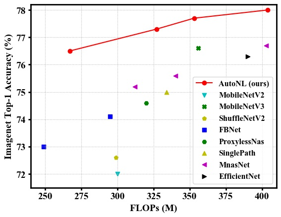

# Neural Architecture Search for Lightweight Non-Local Networks

This repository contains the code for CVPR 2020 paper [Neural Architecture Search for Lightweight Non-Local Networks](https://arxiv.org/abs/2004.xxxxx). 
This paper present a lightweight non-local block and automatically discover state-of-the-art non-local networks for mobile vision.

<div align="center">
  
</div>

If you use the code, please cite:

    @article{li2020autonl,
    title={AutoNL: Neural Architecture Search for Lightweight Non-local Networks in Mobile Vision},
    author={Li, Yingwei and Jin, Xiaojie and Mei, Jieru and Lian, Xiaochen and Yang, Linjie and Xie, Cihang and Yu, Qihang and Zhou, Yuyin and Bai, Song and Yuille, Alan},
    booktitle={In submission},
    year={2020}
    }

## Requirements
TensorFlow 1.14.0
tensorpack 0.9.8 (for dataset loading)

## Model Preparation 
Download the [AutoNL-L-77.7.zip](https://livejohnshopkins-my.sharepoint.com/:u:/g/personal/yli286_jh_edu/EcfjxufrZTNLkxQG_929cPABhwmfBupJreOQSMlIm18Tvg?e=ZOWJIm) and [AutoNL-S-76.5.zip](https://livejohnshopkins-my.sharepoint.com/:u:/g/personal/yli286_jh_edu/ES89oOHhIeBBpRCO76vaspAB1hmFytENyJGHSOwI__3aWw?e=VghMRF) pretrained models. 
Unzip and place them at the root directory of the source code.

## Usage
I download and place the ImageNet validation set at ```/home/yingwei/data/ImageNet/val```.
```bash
python eval.py --model_dir=AutoNL-S-76.5 --valdir=/home/yingwei/data/ImageNet/val --arch=AutoNL-S-76.5/arch.txt
python eval.py --model_dir=AutoNL-L-77.7 --valdir=/home/yingwei/data/ImageNet/val --arch=AutoNL-L-77.7/arch.txt
```
The last printed line should read:
```
Test: [50000/50000]     Prec@1 77.7     Prec@5 93.7
```
for AutoNL-L, and
```
Test: [50000/50000]     Prec@1 76.5     Prec@5 93.1
```
for AutoNL-S.

## Acknowledgements
Part of code comes from [single-path-nas](https://github.com/dstamoulis/single-path-nas), [mnasnet](https://github.com/tensorflow/tpu/tree/master/models/official/mnasnet) 
and [ImageNet-Adversarial-Training](https://github.com/facebookresearch/ImageNet-Adversarial-Training).

If you encounter any problems or have any inquiries, please contact us at yingwei.li@jhu.edu.